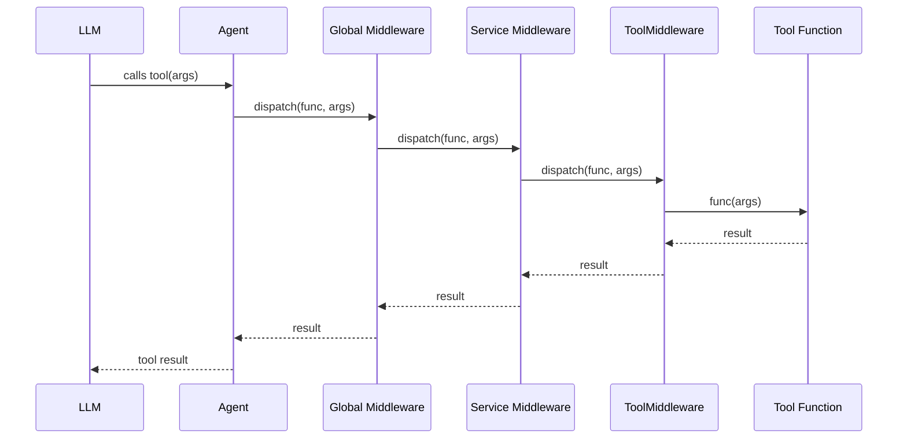
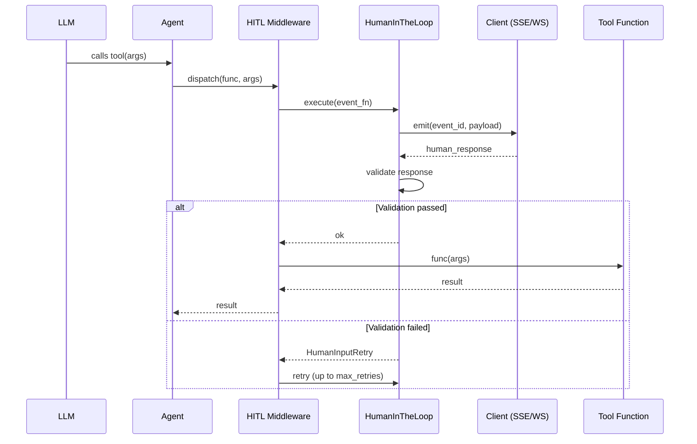
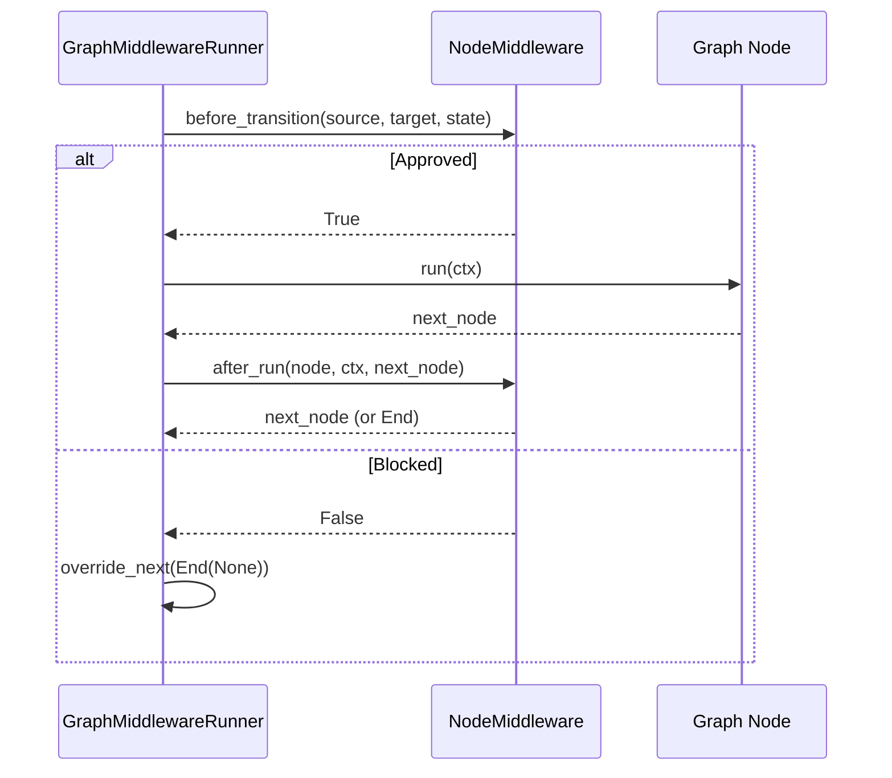

# to-tool-manager

> Convert plain Python service classes into AI tool specifications for LLM integration.

**Version:** 0.9.1 | **Python:** >=3.12 | **License:** MIT

---

## What is it?

`to-tool-manager` is a framework that lets you write ordinary Python classes (services) and automatically exposes their public methods as **tools** that LLMs can call via [pydantic-ai](https://github.com/pydantic/pydantic-ai).

## What problem does it solve?

When building LLM-powered applications you need to:

1. Write business logic (Python classes).
2. Manually define JSON schemas or tool decorators for every method the LLM should call.
3. Wire each tool into an agent.
4. Add cross-cutting concerns (auth, logging, rate limiting, human-in-the-loop) without polluting business code.

`to_tool_manager` eliminates all that boilerplate. You write a plain class, wrap it in a `Service`, and the framework **auto-discovers** its public methods, generates the tool schemas, and assembles a pydantic-ai `Agent` ready to use. Middlewares can be stacked at the service, module, or global level — including human-in-the-loop flows — without touching business logic.

### Architecture at a glance

```
Python class  ──>  Service  ──>  Module (optional)  ──>  ToToolManager / TTMBuilder  ──>  Agent
                     │                                                        │
                     └── ToolMiddleware (per-method)              Global Middleware (per-call)
                                                                  NodeMiddleware (graph transitions)
```

---

## Installation

```bash
pip install to-tool-manager
```

Or with `uv`:

```bash
uv add to-tool-manager
```

---

## Core Classes

### 1. Service

Wraps a Python class and auto-discovers its public methods as LLM tools.

**Constructor Parameters**

| Parameter | Type | Default | Description |
|---|---|---|---|
| `name` | `str` | *(required)* | Unique identifier for the service |
| `service` | `type` | *(required)* | The Python class to wrap |
| `instructions` | `str` | *(required)* | Instructions for the LLM about when to use this service |
| `middleware` | `List[ToolMiddleware \| Middleware] \| None` | `[]` | Middleware instances applied to this service |
| `disable_middlewares` | `Tuple[str, ...]` | `()` | Names of middlewares to skip (inherited from parent layers) |
| `include` | `MethodsType \| Include \| None` | `None` | Methods to include (takes priority over exclude) |
| `exclude` | `MethodsType \| Exclude \| None` | `None` | Methods to exclude |
| `args` | `Tuple[Any, ...]` | `()` | Positional args passed to `service.__init__()` |
| `kwargs` | `Dict[str, Any]` | `{}` | Keyword args passed to `service.__init__()` |

**Public Methods**

| Method | Parameters | Returns | Exceptions | Description |
|---|---|---|---|---|
| `add_middleware(middleware)` | `middleware: ToolMiddleware` | `None` | — | Appends a middleware to the service's list |
| `build_as_capability()` | — | `Capability` | — | Discovers public methods, applies ToolMiddlewares, creates pydantic-ai `Capability` with `Tool` wrappers |
| `service_to_dependency(dinamic_depend)` | `dinamic_depend: DinamicDepend` | `None` | — | Registers the service instance as a dynamic dependency |

---

### 2. Module

Groups multiple `Service` instances into a **sub-agent**. Each module can have its own model, instructions, and middleware layer.

**Constructor Parameters**

| Parameter | Type | Default | Description |
|---|---|---|---|
| `name` | `str` | *(required)* | Unique identifier |
| `services` | `Sequence[Service]` | *(required)* | Services to group |
| `description` | `str` | *(required)* | Description for the sub-agent |
| `capabilities` | `List[Capability] \| None` | `None` | Pre-built capabilities |
| `middleware` | `List \| None` | `None` | Middlewares applied to all services in this module |
| `disable_middlewares` | `Tuple[str, ...]` | `()` | Middleware names to disable |
| `model` | `Model \| KnownModelName \| str \| None` | `None` | LLM model for this sub-agent |
| `instructions` | `Any` | `None` | Agent instructions |
| `system_prompt` | `str \| Sequence[str]` | `()` | System prompt |
| `model_settings` | `AgentModelSettings \| None` | `None` | Model settings |
| `retries` | `int \| AgentRetries \| None` | `None` | Retry configuration |
| `validation_context` | `Any \| Callable \| None` | `None` | Validation context |
| `tools` | `Sequence[Any]` | `()` | Additional tools |
| `toolsets` | `Sequence[AgentToolset] \| None` | `None` | Additional toolsets |
| `defer_model_check` | `bool` | `False` | Defer model validation |
| `end_strategy` | `EndStrategy` | `'graceful'` | End strategy |
| `metadata` | `Any` | `None` | Metadata |
| `tool_timeout` | `float \| None` | `None` | Tool timeout in seconds |
| `max_concurrency` | `Any` | `None` | Max concurrency limit |
| `output_type` | `Any` | `str` | Output type |

**Public Methods / Properties**

| Method / Property | Parameters | Returns | Exceptions | Description |
|---|---|---|---|---|
| `agent` *(property)* | — | `Agent[DinamicDepend]` | `AgentNotBuiltError` | Returns the built agent (call `build_as_agent()` first) |
| `agent` *(setter)* | `agent: Agent` | — | `AgentAlreadyBuiltError` | Sets the agent (raises if already built) |
| `dependency` *(property)* | — | `DinamicDepend` | — | Returns the dynamic dependency container |
| `build_as_agent()` | — | `SubAgent[DinamicDepend]` | `SelfDisableMiddlewareError` | Builds the module as a SubAgent with all its services' capabilities |

---

### 3. ToToolManager

Orchestrates `Service` and `Module` instances, resolves middleware chains, and builds the final pydantic-ai `Agent`.

**Constructor Parameters**

| Parameter | Type | Default | Description |
|---|---|---|---|
| `name` | `str` | *(required)* | Orchestrator name |
| `resources` | `Sequence[Service \| Module]` | *(required)* | Services and modules to orchestrate |
| `middlewares` | `Sequence[Middleware] \| None` | `None` | Global middlewares applied to all tool calls |
| `model` | `Model \| KnownModelName \| str \| None` | `None` | LLM model |
| `instructions` | `Any` | `None` | Agent instructions |
| `system_prompt` | `str \| Sequence[str]` | `()` | System prompt |
| `model_settings` | `AgentModelSettings \| None` | `None` | Model settings |
| `retries` | `int \| AgentRetries \| None` | `None` | Retry count |
| `validation_context` | `Any` | `None` | Validation context |
| `tools` | `Sequence[Any]` | `()` | Additional tools |
| `toolsets` | `Sequence[AgentToolset] \| None` | `None` | Additional toolsets |
| `defer_model_check` | `bool` | `False` | Defer model check |
| `end_strategy` | `EndStrategy` | `'graceful'` | End strategy |
| `metadata` | `Any` | `None` | Metadata |
| `tool_timeout` | `float \| None` | `None` | Tool timeout |
| `max_concurrency` | `AnyConcurrencyLimit` | `None` | Max concurrency |
| `output_type` | `Any` | `str` | Output type |
| `description` | `str \| None` | `None` | Description |

**Public Methods / Properties**

| Method / Property | Parameters | Returns | Exceptions | Description |
|---|---|---|---|---|
| `name` *(property)* | — | `str` | — | Returns orchestrator name |
| `agent` *(property)* | — | `Agent[DinamicDepend]` | `AgentNotBuiltError` | Returns built agent |
| `middlewares` *(property)* | — | `Sequence[Middleware]` | `MiddlewareNotInitializedError` | Returns middlewares list |
| `services` *(property)* | — | `Dict[str, Service]` | — | Returns copy of registered services |
| `modules` *(property)* | — | `Dict[str, Module]` | — | Returns copy of registered modules |
| `get_service(name)` | `name: str` | `Service \| Module` | `ServiceNotFoundError` | Gets a service or module by name |
| `build_agent(resources, middlewares)` | `resources: Sequence \| None`, `middlewares: Sequence \| None` | `Agent[DinamicDepend]` | `InvalidResourceTypeError` | Builds the pydantic-ai Agent |
| `add_middleware_to_service(service_name, middleware)` | `service_name: str`, `middleware: Middleware` | `None` | `ServiceNotFoundError`, `MiddlewareTargetMismatchError` | Adds middleware to a specific service |
| `add_middleware_to_module(module_name, middleware)` | `module_name: str`, `middleware: Middleware` | `None` | `ServiceNotFoundError`, `MiddlewareTargetMismatchError` | Adds middleware to a specific module |
| `remove_middleware_to_service(service_name, middleware_type)` | `service_name: str`, `middleware_type: type` | `None` | `ServiceNotFoundError`, `MiddlewareTargetMismatchError` | Removes middleware by type from a service |
| `remove_middleware_to_module(module_name, middleware_type)` | `module_name: str`, `middleware_type: type` | `None` | `ServiceNotFoundError`, `MiddlewareTargetMismatchError` | Removes middleware by type from a module |

---

### 4. TTMBuilder

Fluent builder API for declaratively assembling agents. Supports method chaining and context manager usage.

**Constructor Parameters**

| Parameter | Type | Default | Description |
|---|---|---|---|
| `name` | `str` | *(required)* | Agent name |
| `capabilities` | `List \| None` | `None` | Pre-built capabilities |
| `toolsets` | `List \| None` | `None` | Pre-built toolsets |
| `model` | `Model \| KnownModelName \| str \| None` | `None` | LLM model |
| `instructions` | `Any` | `None` | Agent instructions |
| `system_prompt` | `str \| Sequence[str]` | `()` | System prompt |
| `model_settings` | `AgentModelSettings \| None` | `None` | Model settings |
| `retries` | `int \| AgentRetries \| None` | `None` | Retry count |
| `validation_context` | `Any` | `None` | Validation context |
| `tools` | `Sequence[Any]` | `()` | Additional tools |
| `defer_model_check` | `bool` | `False` | Defer model check |
| `end_strategy` | `EndStrategy` | `'graceful'` | End strategy |
| `metadata` | `Any` | `None` | Metadata |
| `tool_timeout` | `float \| None` | `None` | Tool timeout |
| `max_concurrency` | `AnyConcurrencyLimit` | `None` | Max concurrency |
| `output_type` | `Any` | `str` | Output type |
| `description` | `str \| None` | `None` | Description |

**Fluent API Methods** (all return `self` for chaining)

| Method | Parameters | Returns | Exceptions | Description |
|---|---|---|---|---|
| `add_service(name, service, instructions, ...)` | See below | `TTMBuilder` | — | Adds a service |
| `add_module(name, services, description, ...)` | See below | `TTMBuilder` | `SelfDisableMiddlewareError` | Adds a module |
| `add_middleware(middleware)` | `middleware: Middleware` | `TTMBuilder` | — | Adds a global middleware |
| `remove_middleware_to_service(service_name, middleware_type)` | `service_name: str`, `middleware_type: type` | `TTMBuilder` | `ServiceNotFoundError` | Removes middleware from a service |
| `add_skill(skill)` | `skill: Skill` | `TTMBuilder` | — | Adds a pydantic-ai-skill |
| `add_ttm(manager)` | `manager: ToToolManager` | `TTMBuilder` | `ToToolManagerAlreadyRegisteredError` | Adds an existing ToToolManager |
| `build(model)` | `model: str \| None = None` | `None` | — | Constructs the Agent (`model` param overrides `__init__` model) |
| `to_mcp_tool(name, instructions)` | `name: str`, `instructions: str` | `FastMCP` | — | Converts to a FastMCP server |

**`add_service` sub-parameters**

| Parameter | Type | Default |
|---|---|---|
| `name` | `str` | *(required)* |
| `service` | `type` | *(required)* |
| `instructions` | `str` | *(required)* |
| `middleware` | `List \| None` | `None` |
| `disable_middlewares` | `Tuple[str, ...]` | `()` |
| `include` | `MethodsType \| Include \| None` | `None` |
| `exclude` | `MethodsType \| Exclude \| None` | `None` |
| `args` | `tuple` | `()` |
| `kwargs` | `dict \| None` | `None` |

**Context Manager**

```python
with TTMBuilder(name="Agent") as builder:
    builder.add_service(...)
    # build() is called automatically on __exit__
agent = builder.agent
```

---

## Middleware System

Middlewares intercept tool calls (or graph node transitions) without touching business logic. They form a chain: the first middleware in the list is the outermost (executes first).

### Tool Call Middleware Flow (Mermaid)



### HITL (Human-in-the-Loop) Middleware Flow (Mermaid)



### Graph Node Middleware Flow (Mermaid)



---

### Middleware Classes

#### Middleware (ABC)

Base abstract middleware for intercepting tool calls.

| Method | Parameters | Returns | Description |
|---|---|---|---|
| `__call__(func)` | `func: Callable` | `Callable` | Wraps func; returns async wrapper that calls `self.dispatch(func, ...)` |
| `call_func(func, *args, **kwargs)` *(static)* | `func: Callable`, `*args`, `**kwargs` | `Any` | Helper to call sync or async func from dispatch |
| `name` *(property)* | — | `str` | Returns middleware name (auto-set to class name) |
| `dispatch(func, /, *args, **kw)` *(abstract)* | `func: Callable`, `*args`, `**kw` | `Any` | **Must be implemented.** Intercepts the tool call. |

#### ToolMiddleware

Extends `Middleware`. Adds method-level filtering via `include`/`exclude`.

| Parameter | Type | Default | Description |
|---|---|---|---|
| `include` | `MethodsType \| Include \| None` | `None` | Methods to include |
| `exclude` | `MethodsType \| Exclude \| None` | `None` | Methods to exclude |

| Method | Parameters | Returns | Description |
|---|---|---|---|
| `include` *(property)* | — | `frozenset[str] \| None` | Returns include filter as frozenset |
| `exclude` *(property)* | — | `frozenset[str] \| None` | Returns exclude filter as frozenset |
| `is_allowed(method_name)` | `method_name: str` | `bool` | Checks if method passes filter. **Include takes priority over exclude.** |

#### NodeMiddleware (ABC)

Base middleware for graph node transitions (`pydantic_graph`).

| Method | Parameters | Returns | Description |
|---|---|---|---|
| `name` *(property)* | — | `str` | Returns middleware name |
| `before_transition(source_node_id, target_node_id, state)` | `str \| None`, `str`, `Any` | `bool` | Hook before transition. Return `True` to approve, `False` to block. |
| `before_run(node, ctx)` | `BaseNode`, `GraphRunContext` | `None` | Hook before node execution (for NodeWrapper). Modify state. |
| `after_run(node, ctx, next_node)` | `BaseNode`, `GraphRunContext`, `BaseNode \| End` | `BaseNode \| End` | Hook after node execution. Return next_node or End. |

#### NodeWrapper

Wraps a graph node with a chain of `NodeMiddleware` instances.

| Method | Parameters | Returns | Description |
|---|---|---|---|
| `run(ctx)` | `ctx: GraphRunContext` | `BaseNode \| End` | Executes wrapped node with before_run/after_run hooks from middlewares |

#### HumanInTheLoopMiddleware

Global HITL middleware — applies to **all** tool calls.

| Parameter | Type | Default | Description |
|---|---|---|---|
| `hitl` | `HumanInTheLoop` | *(required)* | HITL coordinator |
| `max_retries` | `int` | `3` | Max HITL retry attempts |

| Method | Parameters | Returns | Description |
|---|---|---|---|
| `dispatch(func, /, *args, **kw)` | `func: Callable`, `*args`, `**kw` | `Any` | Runs HITL cycle (emit → wait → validate) before executing the tool |

#### HumanInTheLoopToolMiddleware

Per-method HITL middleware with `include`/`exclude` filtering.

| Parameter | Type | Default | Description |
|---|---|---|---|
| `hitl` | `HumanInTheLoop` | *(required)* | HITL coordinator |
| `max_retries` | `int` | `3` | Max HITL retry attempts |
| `include` | `MethodsType \| Include \| None` | `None` | Methods to include |
| `exclude` | `MethodsType \| Exclude \| None` | `None` | Methods to exclude |

| Method | Parameters | Returns | Description |
|---|---|---|---|
| `dispatch(func, /, *args, **kw)` | `func: Callable`, `*args`, `**kw` | `Any` | Runs HITL cycle for filtered methods |

#### GraphMiddlewareRunner

Executes a `pydantic_graph` with a `NodeMiddleware` chain on each transition.

| Parameter | Type | Default | Description |
|---|---|---|---|
| `graph` | `Graph[Any, Any, Any, Any]` | *(required)* | The graph to run |
| `middlewares` | `Sequence[NodeMiddleware]` | *(required)* | Middlewares to apply on transitions |

| Method | Parameters | Returns | Description |
|---|---|---|---|
| `run(state, deps, inputs)` | `state: Any`, `deps: Any`, `inputs: Any` | `Any` | Runs the graph; each transition passes through the middleware chain. Returns `None` if any middleware blocks, or the final `End.value` on success. |

---

## Exceptions

All exceptions inherit from `TTMError` for generic capture.

```
TTMError
├── ConfigurationError
│   ├── InvalidResourceTypeError(got_type: str)
│   └── SelfDisableMiddlewareError(middleware_name: str)
├── ServiceError
│   ├── ServiceNotFoundError(name: str)
│   ├── ServiceAlreadyRegisteredError(name: str)
│   └── DependencyNotSetError(name: str)
├── ModuleError
│   └── ModuleAlreadyRegisteredError(name: str)
├── AgentError
│   ├── AgentNotBuiltError(component: str)
│   └── AgentAlreadyBuiltError(component: str)
├── MiddlewareError
│   ├── MiddlewareNotInitializedError()
│   └── MiddlewareTargetMismatchError(name: str, expected: str)
└── BuilderError
    ├── ToToolManagerAlreadyRegisteredError(name: str)
    └── ToToolManagerNotFoundError(name: str)
```

| Exception | Message Pattern | When it is raised |
|---|---|---|
| `InvalidResourceTypeError` | `"Expected Service or Module, got {got_type}"` | A resource passed to `ToToolManager` is neither `Service` nor `Module` |
| `SelfDisableMiddlewareError` | `"Cannot disable middleware '{name}' in the same class that declares it..."` | A `Module` tries to disable a middleware it declares itself |
| `ServiceNotFoundError` | `"Unknown service '{name}'"` | Lookup by name fails in `ToToolManager` |
| `ServiceAlreadyRegisteredError` | `"Service '{name}' already registered"` | Duplicate service name in `Manager` |
| `DependencyNotSetError` | `"DinamicDepend has no attribute '{name}'"` | Accessing an unset dependency |
| `ModuleAlreadyRegisteredError` | `"Module '{name}' already registered"` | Duplicate module name in `Manager` |
| `AgentNotBuiltError` | `"Agent not built. Call build() first on {component}."` | Accessing `.agent` before calling `build()` / `build_agent()` |
| `AgentAlreadyBuiltError` | `"Agent already built on {component}. Cannot rebuild."` | Attempting to rebuild an already-built agent |
| `MiddlewareNotInitializedError` | `"Middleware sequence is not initialized (None)"` | Accessing `.middlewares` when none were provided |
| `MiddlewareTargetMismatchError` | `"'{name}' is not a {expected}..."` | Adding middleware to wrong target type (e.g., module method on a service) |
| `ToToolManagerAlreadyRegisteredError` | `"ToToolManager '{name}' already registered"` | Duplicate TTM name in `Manager` |
| `ToToolManagerNotFoundError` | `"ToToolManager '{name}' not found"` | TTM lookup by name fails in `Manager` |

Additionally, `HumanInputRetry` (extends `Exception`) is thrown by HITL logic when validation fails — the middleware catches it and retries.

---

## Examples

The following examples use two in-memory CRUD classes: `UserManager` and `OrderManager`.

### Shared CRUD Classes

```python
from dataclasses import dataclass, field


@dataclass
class User:
    id: str
    name: str
    email: str


@dataclass
class Order:
    id: str
    user_id: str
    product: str
    quantity: int
    status: str = "pending"


class UserManager:
    """In-memory CRUD for users."""

    def __init__(self):
        self._users: dict[str, User] = {}

    def create(self, id: str, name: str, email: str) -> str:
        self._users[id] = User(id=id, name=name, email=email)
        return f"User {id} created: {name}"

    def get(self, id: str) -> str:
        user = self._users.get(id)
        if not user:
            return f"User {id} not found."
        return f"User {user.id}: {user.name} <{user.email}>"

    def list_all(self) -> str:
        if not self._users:
            return "No users."
        return "; ".join(f"{u.name} <{u.email}>" for u in self._users.values())

    def delete(self, id: str) -> str:
        if id not in self._users:
            return f"User {id} not found."
        del self._users[id]
        return f"User {id} deleted."


class OrderManager:
    """In-memory CRUD for orders."""

    def __init__(self):
        self._orders: dict[str, Order] = {}

    def create(self, id: str, user_id: str, product: str, quantity: int) -> str:
        self._orders[id] = Order(id=id, user_id=user_id, product=product, quantity=quantity)
        return f"Order {id} created: {quantity}x {product} for user {user_id}"

    def get(self, id: str) -> str:
        order = self._orders.get(id)
        if not order:
            return f"Order {id} not found."
        return f"Order {order.id}: {order.quantity}x {order.product} [{order.status}]"

    def list_all(self) -> str:
        if not self._orders:
            return "No orders."
        return "; ".join(f"{o.id}: {o.quantity}x {o.product}" for o in self._orders.values())

    def update_status(self, id: str, status: str) -> str:
        order = self._orders.get(id)
        if not order:
            return f"Order {id} not found."
        order.status = status
        return f"Order {id} status updated to {status}"

    def delete(self, id: str) -> str:
        if id not in self._orders:
            return f"Order {id} not found."
        del self._orders[id]
        return f"Order {id} deleted."
```

### Shared Middlewares

```python
from to_tool_manager.core.middleware.middleware import Middleware, ToolMiddleware


class AuthMiddleware(ToolMiddleware):
    """Simulates authentication check. Applies only to specified methods."""

    async def dispatch(self, func, /, *args, **kw):
        print("[Auth] Verifying access...")
        return await func(*args, **kw)


class LogMiddleware(Middleware):
    """Logs every tool call. Applies globally to all methods."""

    async def dispatch(self, func, /, *args, **kw):
        print(f"[Log] Calling {func.__name__}")
        result = await func(*args, **kw)
        print(f"[Log] {func.__name__} returned {len(str(result))} chars")
        return result


class RateLimitMiddleware(Middleware):
    """Simulates rate limiting. Applies globally."""

    def __init__(self, max_calls: int = 10):
        self._count = 0
        self._max = max_calls

    async def dispatch(self, func, /, *args, **kw):
        self._count += 1
        if self._count > self._max:
            return "Rate limit exceeded. Try again later."
        return await func(*args, **kw)
```

---

### Example 1 — Service with Module

A single service wrapped in a `Module` (sub-agent), with a global `LogMiddleware`.

```python
from to_tool_manager.core.main.service import Service
from to_tool_manager.core.main.module import Module
from to_tool_manager.core.main.to_tool_manager import ToToolManager


# Wrap the class
user_service = Service(
    name="users",
    service=UserManager,
    instructions="Use this service for user CRUD operations.",
)

# Group into a module
users_module = Module(
    name="UsersModule",
    services=[user_service],
    description="Manages user data.",
    middleware=[LogMiddleware()],
)

# Orchestrate with ToToolManager
manager = ToToolManager(
    name="App",
    resources=[users_module],
)

agent = manager.build_agent()
# agent is ready to use with an LLM
```

---

### Example 2 — Two Services with Module

Two services inside one `Module`, each with its own `ToolMiddleware`.

```python
user_service = Service(
    name="users",
    service=UserManager,
    instructions="User CRUD operations.",
    middleware=[
        AuthMiddleware(include=frozenset({"create", "delete"})),
    ],
)

order_service = Service(
    name="orders",
    service=OrderManager,
    instructions="Order CRUD operations.",
    middleware=[
        AuthMiddleware(include=frozenset({"create", "update_status"})),
    ],
)

commerce_module = Module(
    name="Commerce",
    services=[user_service, order_service],
    description="E-commerce backend: users and orders.",
    middleware=[LogMiddleware()],
)

manager = ToToolManager(
    name="ECommerce",
    resources=[commerce_module],
)

agent = manager.build_agent()
```

---

### Example 3 — Services + Module + ToToolManager

Services at different levels: some inside a `Module`, some directly registered in `ToToolManager`.

```python
user_service = Service(
    name="users",
    service=UserManager,
    instructions="User CRUD.",
    middleware=[AuthMiddleware(include=frozenset({"delete"}))],
)

order_service = Service(
    name="orders",
    service=OrderManager,
    instructions="Order CRUD.",
)

# Module for commerce
commerce_module = Module(
    name="Commerce",
    services=[user_service, order_service],
    description="Commerce sub-agent.",
    middleware=[LogMiddleware()],
)

# Manager with module + additional global middleware
manager = ToToolManager(
    name="FullApp",
    resources=[commerce_module],
    middlewares=[RateLimitMiddleware(max_calls=50)],
)

# Dynamically add middleware to a specific service
manager.add_middleware_to_service(
    "orders",
    AuthMiddleware(include=frozenset({"update_status"})),
)

agent = manager.build_agent()
```

---

### Example 4 — Services + Module + TTMBuilder

Using the fluent builder API to assemble everything declaratively.

```python
from to_tool_manager.core.builder.ttm_builder import TTMBuilder


with TTMBuilder(name="ECommerceAgent") as builder:
    # Add services
    builder.add_service(
        name="users",
        service=UserManager,
        instructions="User CRUD operations.",
        middleware=[AuthMiddleware(include=frozenset({"create", "delete"}))],
    )

    builder.add_service(
        name="orders",
        service=OrderManager,
        instructions="Order CRUD operations.",
    )

    # Add a module
    builder.add_module(
        name="Commerce",
        services=[
            Service(
                name="users_v2",
                service=UserManager,
                instructions="User management v2.",
            ),
            Service(
                name="orders_v2",
                service=OrderManager,
                instructions="Order management v2.",
            ),
        ],
        description="Commerce sub-agent with additional services.",
        middleware=[LogMiddleware()],
    )

    # Global middlewares
    builder.add_middleware(RateLimitMiddleware(max_calls=100))

# build() called automatically on __exit__
agent = builder.agent
```

---

### Example 5 — Graph with GraphMiddlewareRunner

Using `pydantic_graph` with `NodeMiddleware` to control node transitions.

```python
from __future__ import annotations

from dataclasses import dataclass

from pydantic_graph import BaseNode, End, Graph, GraphRunContext

from to_tool_manager.core.middleware.middleware import NodeMiddleware
from to_tool_manager.middleware.graph_runner import GraphMiddlewareRunner


# --- State ---
@dataclass
class PipelineState:
    user_id: str
    validated: bool = False
    result: str | None = None


# --- Nodes ---
@dataclass
class ValidateUser(BaseNode[PipelineState]):
    async def run(self, ctx: GraphRunContext[PipelineState]) -> ProcessOrder:
        ctx.state.validated = True
        return ProcessOrder()


@dataclass
class ProcessOrder(BaseNode[PipelineState, None, str]):
    async def run(self, ctx: GraphRunContext[PipelineState]) -> End[str]:
        ctx.state.result = f"Order processed for user {ctx.state.user_id}"
        return End(ctx.state.result)


# --- Middleware ---
class AuditMiddleware(NodeMiddleware):
    """Logs every node transition and blocks if user_id is empty."""

    async def before_transition(self, source_node_id, target_node_id, state):
        print(f"[Audit] {source_node_id} -> {target_node_id}")
        if hasattr(state, "user_id") and not state.user_id:
            print("[Audit] BLOCKED: empty user_id")
            return False
        return True


# --- Graph ---
pipeline_graph = Graph(nodes=(ValidateUser, ProcessOrder))


async def run_pipeline(user_id: str) -> str:
    runner = GraphMiddlewareRunner(
        graph=pipeline_graph,
        middlewares=[AuditMiddleware()],
    )
    state = PipelineState(user_id=user_id)
    return await runner.run(state=state)


# Usage:
# result = await run_pipeline("user-42")   # runs normally
# result = await run_pipeline("")           # blocked by AuditMiddleware
```

---

## HITL Example

A complete Human-in-the-Loop flow using SSE events to require human approval before executing a tool.

```python
from typing import Any

from to_tool_manager.provider.human_in_the_loop import (
    EventEmitter,
    HumanInTheLoop,
)
from to_tool_manager.middleware.hitl import (
    HumanInTheLoopMiddleware,
    HumanInTheLoopToolMiddleware,
)


# 1. Implement EventEmitter for your framework
class SSEEventEmitter(EventEmitter):
    def __init__(self, send_fn):
        self._send = send_fn

    async def emit(self, event_id: str, payload: dict[str, Any]) -> None:
        await self._send({"event": event_id, "data": payload})


# 2. Define the HITL logic
async def approval_logic(emit, event_fn, action: str):
    """Emits an approval request, waits for response, validates."""
    await emit("approval_request", {
        "action": action,
        "message": f"Do you approve this action: {action}?",
    })
    # In a real app, this would wait for a websocket/SSE response.
    # If rejected, raise HumanInputRetry to retry the cycle.


# 3. Create HITL coordinator
emitter = SSEEventEmitter(send_fn=your_send_function)
hitl = HumanInTheLoop(
    emitter=emitter,
    logic=approval_logic,
    action="delete_user",  # injected into logic
)

# 4a. Global HITL — applies to ALL tools
global_hitl_mw = HumanInTheLoopMiddleware(hitl=hitl, max_retries=3)

# 4b. Per-method HITL — applies only to filtered methods
selective_hitl_mw = HumanInTheLoopToolMiddleware(
    hitl=hitl,
    max_retries=3,
    include=frozenset({"delete", "update_status"}),
)

# 5. Use in Service or ToToolManager
service = Service(
    name="orders",
    service=OrderManager,
    instructions="Order management.",
    middleware=[selective_hitl_mw],
)
```

---

## Public API

```python
from to_tool_manager import (
    # Core
    Service,
    Module,
    ToToolManager,
    TTMBuilder,

    # Middleware
    Middleware,
    ToolMiddleware,
    NodeMiddleware,
    GraphMiddlewareRunner,

    # HITL
    EventEmitter,
    HumanInTheLoop,
    HumanInTheLoopMiddleware,
    HumanInTheLoopToolMiddleware,
    HumanInputRetry,

    # Exceptions
    TTMError,
    ConfigurationError,
    InvalidResourceTypeError,
    SelfDisableMiddlewareError,
    ServiceError,
    ServiceNotFoundError,
    ServiceAlreadyRegisteredError,
    DependencyNotSetError,
    ModuleError,
    ModuleAlreadyRegisteredError,
    AgentError,
    AgentNotBuiltError,
    AgentAlreadyBuiltError,
    MiddlewareError,
    MiddlewareNotInitializedError,
    MiddlewareTargetMismatchError,
    BuilderError,
    ToToolManagerAlreadyRegisteredError,
    ToToolManagerNotFoundError,
)
```

---

## Dependencies

- `pydantic-ai-slim[cli,openai]>=2.37.0`
- `pydantic-ai-harness>=0.28.0`
- `pydantic-ai-skills>=1.4.0`
- `pydantic-graph>=2.37.0`
- `subagents-pydantic-ai>=0.2.21`
- `fastmcp>=4.0.2`

---

## Links

- **Repository:** https://github.com/Davidmg5k/ToToolManager
